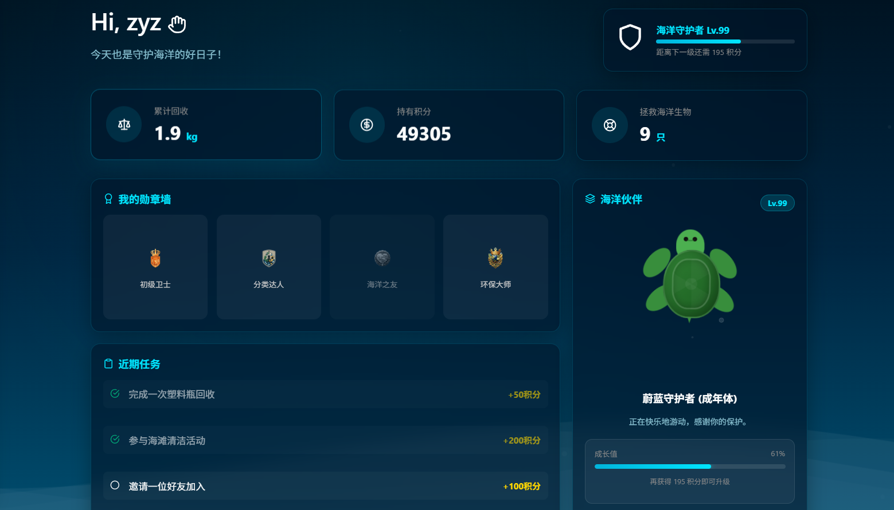
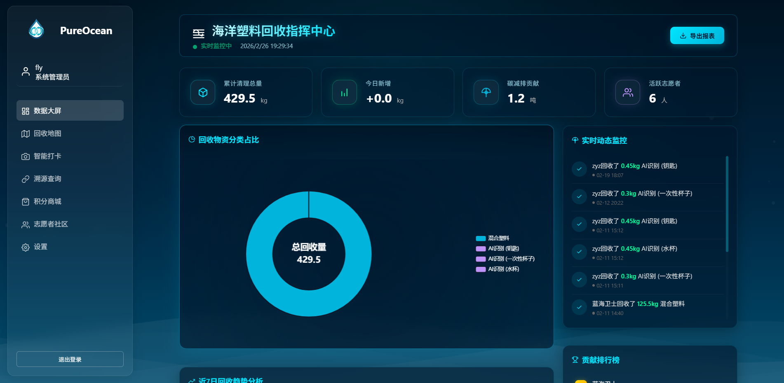

# PureOcean - 守护蔚蓝：海洋塑料回收与科普公益平台 🌊

[](https://vuejs.org/)
[](https://nodejs.org/)
[](https://www.mysql.com/)
[](LICENSE)

**PureOcean** 是一款专为海洋保护设计的全栈公益系统。它结合了现代 Web 技术与环保理念，通过数字化手段追踪塑料回收路径，普及海洋生态知识，并利用积分激励机制鼓励公众参与环保行动。

---

## 📸 项目剪影

|  |  |
| :---: | :---: |
| **志愿者大屏：数据实时监控** | **管理员大屏：系统全景管理** |

|  |  |
| :---: | :---: |
| **主页：深海沉浸式 UI** | **回收地图：实时网点查询** |

|  |  |
| :---: | :---: |
| **区块链：透明化回收溯源** | **商城：环保成果兑换** |

---

## ✨ 核心功能

### 1. 🌊 沉浸式海洋科普
- **海洋百科**：深度解析微塑料、珊瑚礁保护等主题，提升环保意识。
- **动态交互**：基于 **GSAP** 与 **Three.js** 的视觉特效，打造沉浸式浏览体验。
- **科普视频**：内置交互式视频弹窗，直观展示海洋污染现状。

### 2. 📍 智能回收地图
- **网点查询**：集成 **高德地图 API**，实时定位身边的塑料回收点。
- **路线规划**：为用户提供前往回收站的最佳路径指引。

### 3. 🔗 区块链概念溯源
- **透明追踪**：模拟区块链技术，记录塑料从“回收-转运-加工-再利用”的全生命周期。
- **不可篡改**：确保每一份回收记录真实可信，让公益更透明。

### 4. 🛒 环保积分体系
- **每日打卡**：通过签到、参与回收、学习科普知识获取积分。
- **积分商城**：积分可兑换环保周边产品，激励持续参与。

### 5. 📊 数据可视化中心
- **回收统计**：利用 **ECharts** 实时展示个人及全平台的回收贡献数据。
- **排行榜**：设立“分类达人”榜单，激发社区竞争活力。

---

## 🛠️ 技术架构

### 前端 (Frontend)
- **核心框架**：Vue 3 (Composition API)
- **构建工具**：Vite
- **状态管理**：Pinia (全局状态持久化)
- **样式方案**：Tailwind CSS + 原生 CSS (模块化)
- **动效库**：GSAP + Three.js
- **地图服务**：AMap (高德地图)
- **图表展示**：ECharts

### 后端 (Backend)
- **运行环境**：Node.js
- **Web 框架**：Express 5.x
- **数据库**：MySQL (通过 Sequelize ORM 管理)
- **认证授权**：JWT (JSON Web Token) + bcryptjs
- **文件处理**：Multer (支持图片上传)
- **AI 赋能**：集成阿里云图像识别 API (用于垃圾自动分类)

---

## 🚀 快速开始

### 环境要求
- Node.js (v18+)
- MySQL (v8.0+)
- 高德地图 API Key

### 1. 获取项目
```bash
git clone <repository-url>
cd bs
```

### 2. 后端配置
1. 进入目录：`cd server`
2. 安装依赖：`npm install`
3. 配置文件：复制 `.env.example` 为 `.env` 并填写配置：
   ```env
   DB_HOST=localhost
   DB_NAME=pure_ocean
   DB_USER=root
   DB_PASS=你的密码
   JWT_SECRET=随机密钥
   ```
4. 初始化数据库：`npm run seed` (可选，导入初始数据)
5. 启动服务：`npm run dev`

### 3. 前端配置
1. 返回根目录：`cd ..`
2. 安装依赖：`npm install`
3. 启动开发环境：`npm run dev`
4. 访问地址：`http://localhost:5173`

---

## � 目录结构
```text
.
├── server/                 # 后端项目
│   ├── models/             # Sequelize 模型
│   ├── routes/             # API 路由
│   ├── uploads/            # 用户上传资源
│   └── index.js            # 服务端入口
├── src/                    # 前端项目
│   ├── api/                # 接口封装
│   ├── assets/             # 静态资源 (Images, CSS)
│   ├── components/         # 通用组件
│   ├── layouts/            # 布局组件
│   ├── pages/              # 业务页面 (Auth, Mall, Map, etc.)
│   ├── stores/             # Pinia 状态
│   └── utils/              # 工具函数
├── tailwind.config.js      # Tailwind 配置
└── vite.config.ts          # Vite 配置
```

---

## 📄 开源协议
本项目遵循 [MIT License](LICENSE) 开源协议。

---
© 2026 PureOcean | 守护每一片蔚蓝 💙
